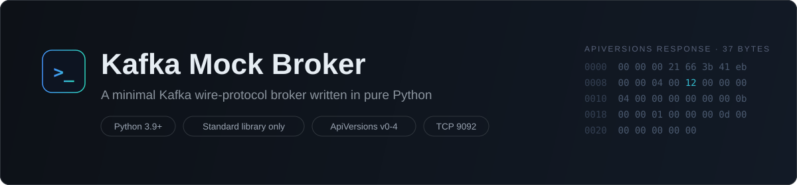
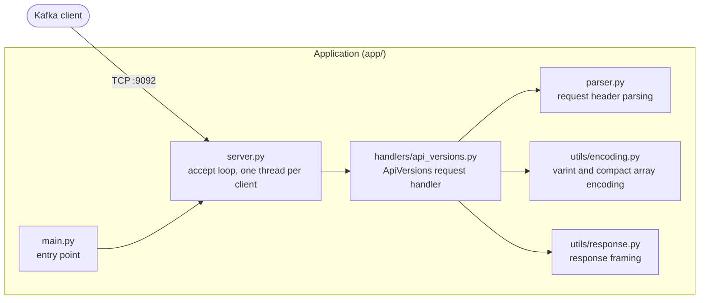
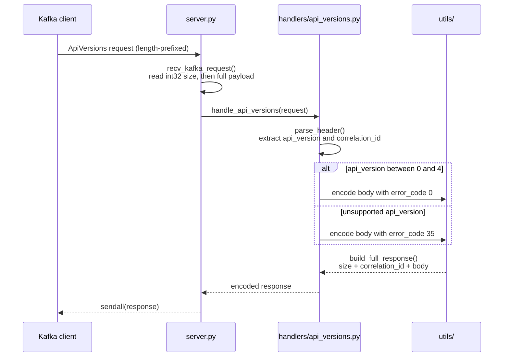

<p align="center">
  
</p>

A minimal Kafka broker implementation written in pure Python. It speaks the Kafka binary wire protocol (v3+) over TCP and currently implements the `ApiVersions` request/response exchange, the handshake every Kafka client performs when connecting to a broker.

The project is an exercise in low-level protocol engineering: no Kafka libraries, no external dependencies, only raw sockets and hand-written binary encoding.

## Overview

When a Kafka client connects to a broker, its first request is `ApiVersions` (API key 18): the client asks which APIs the broker supports and in which version ranges. This project implements that exchange from scratch, byte by byte, following the Kafka protocol specification:

- Parsing of the binary request header (API version, correlation ID)
- Construction of a fully compliant `ApiVersions` v3+ response (compact arrays, unsigned varints, tagged fields)
- Correct error signaling for unsupported request versions

## Features

- TCP server listening on `localhost:9092` (standard Kafka port)
- Concurrent clients: one daemon thread per connection
- Persistent connections: multiple requests are served over a single connection
- Length-prefixed message framing (int32 size header, full payload read)
- `ApiVersions` handler supporting request versions 0 through 4
- `UNSUPPORTED_VERSION` (error code 35) returned for out-of-range versions
- Kafka-compliant binary encoding: unsigned varints, compact arrays, tagged fields
- Zero dependencies: Python standard library only (`socket`, `threading`)

## Requirements

- Python 3.9 or later
- No third-party packages

## Getting Started

Clone the repository and start the broker:

```bash
git clone https://github.com/Baylox/kafka-mock.git
cd kafka-mock
python -m app.main
```

The server logs each accepted connection and prints the hex dump of every response it sends:

```text
Kafka mock broker listening on port 9092...
Accepted connection from ('127.0.0.1', 52734)
Full response hex: 00000021663b41eb0000040012000000040000000000000b0000010000000d000000000000
```

To exercise the broker with a real Kafka client, point any client at `localhost:9092`. For example, using the CLI tools shipped with Apache Kafka:

```bash
kafka-broker-api-versions.sh --bootstrap-server localhost:9092
```

## Architecture



Request lifecycle for an `ApiVersions` exchange:



## Project Structure

```text
kafka-mock/
├── assets/
│   ├── banner.svg               # README banner
│   └── logo.svg                 # Project mark (social preview, avatar)
├── app/
│   ├── __init__.py              # Package metadata (version, author)
│   ├── main.py                  # Entry point: starts the server
│   ├── server.py                # TCP server, framing, per-client threads
│   ├── parser.py                # Request header parsing
│   ├── handlers/
│   │   └── api_versions.py      # ApiVersions (API key 18) handler
│   └── utils/
│       ├── encoding.py          # Unsigned varint, compact array, compact string
│       └── response.py          # Response framing (size + correlation ID + body)
├── LICENSE
└── README.md
```

## Protocol Details

### ApiVersions response layout (v3+)

| Field              | Type            | Description                                        |
| ------------------ | --------------- | -------------------------------------------------- |
| `message_length`   | int32           | Total message length, excluding this field         |
| `correlation_id`   | int32           | Echoed from the request                            |
| `error_code`       | int16           | 0 = no error, 35 = `UNSUPPORTED_VERSION`           |
| `api_keys`         | compact array   | Length prefix is an unsigned varint of N + 1       |
| — `api_key`        | int16           | API identifier (e.g. 18 for `ApiVersions`)         |
| — `min_version`    | int16           | Lowest supported request version                   |
| — `max_version`    | int16           | Highest supported request version                  |
| — `tagged_fields`  | unsigned varint | Per-entry tag buffer, empty (0x00)                 |
| `throttle_time_ms` | int32           | Client throttling delay, 0 here                    |
| `tagged_fields`    | unsigned varint | Final tag buffer, empty (0x00)                     |

### Advertised API keys

| API key | Name        | Version range |
| ------- | ----------- | ------------- |
| 18      | ApiVersions | 0 - 4         |
| 0       | Produce     | 0 - 11        |
| 1       | Fetch       | 0 - 13        |

`Produce` and `Fetch` are advertised in the response but not yet handled; only `ApiVersions` requests are processed.

### Annotated response example

A successful response as emitted by this broker (33 bytes after the length field):

```text
00000021    message_length = 33
663b41eb    correlation_id (echoed from the request)
0000        error_code = 0 (no error)
04          compact array length (3 entries + 1)
0012 0000 0004 00    ApiVersions: key 18, versions 0-4, empty tag buffer
0000 0000 000b 00    Produce:     key 0,  versions 0-11, empty tag buffer
0001 0000 000d 00    Fetch:       key 1,  versions 0-13, empty tag buffer
00000000    throttle_time_ms = 0
00          final tagged fields (empty)
```

## Design Notes

- Tagged field buffers are always present in v3+ responses and are prefixed with an unsigned varint, even when empty. Omitting them produces a response most clients will reject.
- The compact array length prefix encodes the number of entries plus one, as an unsigned varint. A prefix of `0x04` therefore means three entries.
- Field order is strict. Every field must be encoded and appended exactly in the order defined by the protocol specification; there is no self-describing structure to fall back on.
- The server reads the 4-byte size header first, then loops on `recv` until the full payload has arrived, so partial TCP reads are handled correctly.

## License

This project is licensed under the MIT License. See [LICENSE](LICENSE) for details.
